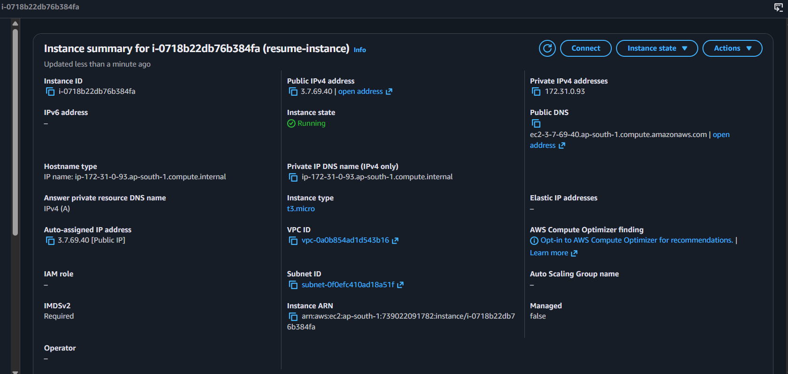
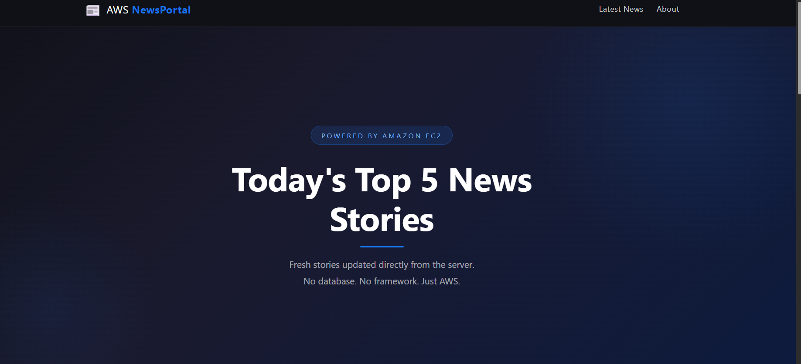
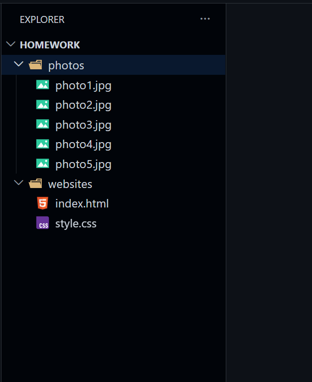
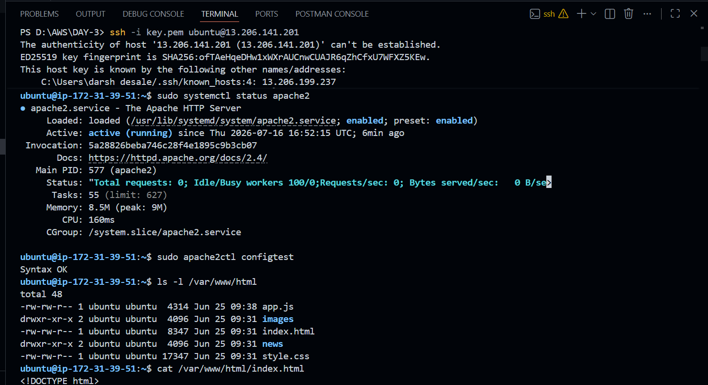

# 📰 AWS News Portal

A simple static news website hosted on an Amazon EC2 instance using the Apache Web Server.

The website loads news articles dynamically from text files stored inside the EC2 instance without using any backend framework or database.

---

# 🚀 Project Overview

This project demonstrates how a static website can be hosted on AWS using Amazon EC2.

Instead of storing articles inside a database, news is stored as plain text files on the server. JavaScript reads those files and renders them dynamically in the browser.

This project helps beginners understand:

- Amazon EC2
- Apache Web Server
- Static Website Hosting
- Dynamic Content using JavaScript
- Linux File System
- Deploying files using FileZilla

---

# ⚙️ Workflow

```

                User
                  │
                  ▼
        Browser Request (HTTP)
                  │
                  ▼
         Amazon EC2 Instance
                  │
        Apache Web Server
                  │
      /var/www/html Directory
                  │
      ┌───────────┴───────────┐
      │                       │
 index.html             app.js
      │                       │
      └───────────┬───────────┘
                  │
         Fetch News Files
                  │
        /news/article1.txt
        /news/article2.txt
        /news/article3.txt
                  │
                  ▼
        Display News Cards

```

---

# ☁️ AWS Services Used

| Service | Purpose |
|----------|----------|
| Amazon EC2 | Hosts the website |
| Ubuntu | Operating System |
| Apache2 | Web Server |
| FileZilla | Upload project files |
| Security Groups | Allow HTTP & SSH traffic |

---

# 📂 Project Structure

```

NewsPortal/
│
├── index.html
├── style.css
├── app.js
├── README.md
│
├── news/
│   ├── article1.txt
│   ├── article2.txt
│   ├── article3.txt
│   ├── article4.txt
│   └── article5.txt
│
└── images/
├── ec2-instance.png
├── website-home.png
├── folder-structure.png
└── apache-flow.png

```

---

# 📸 Screenshots

## EC2 Instance



---

## Website Home Page



---

## Project Folder Structure



---

## apache-flow



---

# 🔄 How It Works

### Step 1

The user enters the EC2 Public IP in the browser.

↓

### Step 2

Apache Web Server receives the HTTP request.

↓

### Step 3

Apache serves the static files from

```

/var/www/html

```

↓

### Step 4

The browser loads

- index.html
- style.css
- app.js

↓

### Step 5

JavaScript fetches news articles from the **news/** folder.

↓

### Step 6

The articles are converted into cards and displayed on the webpage.

---

# 💻 Deployment Steps

### Connect to EC2

```bash
ssh -i key.pem ubuntu@<EC2-PUBLIC-IP>
```

### Install Apache

```bash
sudo apt update
sudo apt install apache2 -y
```

### Copy Website Files

Upload all project files into

```text
/var/www/html
```

using FileZilla or SCP.

### Restart Apache

```bash
sudo systemctl restart apache2
```

### Open Browser

```text
http://http://13.206.141.201/
```

---

# 📦 Technologies Used

- HTML5
- CSS3
- JavaScript
- Ubuntu Linux
- Apache2
- Amazon EC2

---

# 📌 Features

- Responsive UI
- Dynamic News Loading
- Static Website Hosting
- No Database Required
- Beginner Friendly AWS Project
- Apache Web Server
- Simple Deployment
- Easy to Extend

---

# 🎯 Learning Outcomes

After completing this project you will understand:

- How Amazon EC2 works
- What Apache Web Server does
- How browsers request web pages
- Linux directory structure
- Static website deployment
- Dynamic content loading using JavaScript
- File hosting on EC2

---

# 👨‍💻 Author

**Darshan Desale**

AWS | Cloud Computing | Web Development
